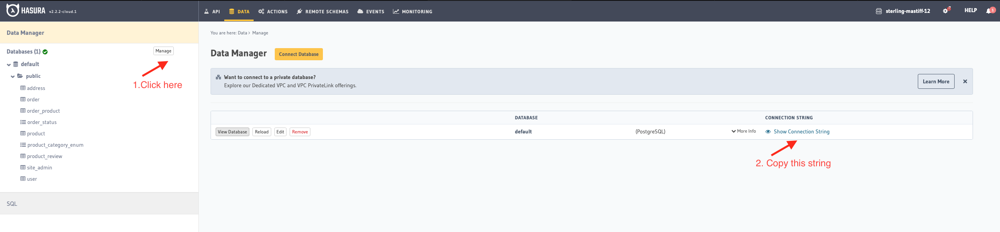

# Hasura and Yugabyte E-Commerce Application

The Hasura and Yugabyte e-commerce app is a full featured reference application demonstrating many of the powerful featues of Hasura's GraphQL Engine and Yugabyte distributed database. 
[Here](https://github.com/hasura/hasura-ecommerce) you can find the original version of the application that uses PostgreSQL as a database and supports only the on-prem deployment option of Hasura.

<!-- vscode-markdown-toc -->

- [Hasura Super App](#hasura-super-app)
  - [Prerequisite](#prerequisite)
  - [Setup Project](#setup-project)
  - [Start Application](#start-application)
    - [Local Deployment](#local-deployment)
    - [Cloud Deployment](#cloud-deployment)
  - [Start Application in Cloud](#start-application-in-cloud)
  - [Application Technical Overview](#application-technical-overview)
  - [Application Architectural Overview](#application-architectural-overview)
    - [Authentication Flow](#authentication-flow)
    - [Checkout Flow](#checkout-flow)
    - [Product Management Flow](#product-management-flow)
    - [GraphQL SDK](#graphql-sdk)
    - [Hasura Migration Flow](#hasura-migration-flow)
    - [3 Factor Applications](#3-factor-applications)
  - [Clear Demo Resources](#clear-demo-resources) 

<!-- vscode-markdown-toc-config
    numbering=false
    autoSave=true
    /vscode-markdown-toc-config -->
<!-- /vscode-markdown-toc -->

## Prerequisite
1. Hasura CLI installed. [Instructions here.](https://hasura.io/docs/latest/graphql/core/hasura-cli/install-hasura-cli.html)
2. (Optional) Stripe Secret and Publishable keys. _The account doesn't need to be verified as no transactions will be happening._ [Instructions here.](https://stripe.com/docs/keys)
3. Local Deployments:
    * Docker and Docker Compose installed. [Install instructions.](https://docs.docker.com/get-docker/)
4. Cloud Deploymets:
    * Hasura Cloud Instance/Project. [Insturctions here](https://hasura.io/docs/latest/graphql/cloud/getting-started/index.html)
    * Yugabyte Cloud Instance. [Instructions here](https://docs.yugabyte.com/latest/yugabyte-cloud/cloud-quickstart/qs-add/)

## Setup Project

1. Clone the project:
    ```bash
    git clone https://github.com/dmagda/hasura-ecommerce
    ```
2. (Optional) Modify the `.env.example` with your real Stripe test keys if you want checkout to work and then execute this command:
    ```bash
    cp .env.example .env
    ```

## Start Application

You can start the application in your local on-prem environment or in the cloud.

### Local Deployment

Follow the steps below to start the demo locally with Docker:

1. Start the demo using YugabyteDB or PostgreSQL as a database:

    For on-prem *PostgreSQL* deployment:
    ```bash
    docker-compose -f docker-compose-postgres.yaml up
    ```

    For on-prem *YugabyteDB* deployment:
    ```bash
    docker-compose -f docker-compose-yugabyte.yaml up
    ```
 
2. Navigate to the `hasura` directory:
    ```bash
    cd hasura
    ```

3. Create the `config.yaml` file from the template for local deployments:
    ```bash
    cp local.config.yaml config.yaml
    ```

4. Create the `databases.yaml` file from the template for local deployments:
    ```bash
    cp metadata/databases/local.databases.yaml metadata/databases/databases.yaml
    ```

5. Apply metadata and load sample data:
    ```sh-session
    hasura metadata apply
    hasura migrate apply
    hasura metadata reload
    hasura seeds apply
    ```

6. Visit the following endpoints:

```sh-session
Visit http://localhost:3000 for Next.js frontend
  Login at /account/login has default credentials "user@site.com:password"
  Login at /admin/account/login has default credentials "admin@site.com:password"
Visit http://localhost:8060 for Hasura console (admin secret = "my-secret")
Visit http://localhost:9000 for Minio dashboard (login = "minio:minio123")
Visit http://localhost:7001 for Yugabyte Master UI
Visit http://localhost:9001 for Yugabyte TServer UI
```

### Cloud Deployment

1. [Interconnect](https://docs.yugabyte.com/latest/yugabyte-cloud/cloud-examples/hasura-cloud/) your Hasura Cloud and Yugabyte Cloud instances.

2. Navigate to the `hasura` directory:
    ```bash
    cd hasura
    ```

3. Create the `config.yaml` file from the template for cloud deployments:
    ```bash
    cp cloud.config.yaml config.yaml
    ```

4. Open the `config.yaml` file and initialize two parameters: 
    * `endpoint` - use the value of the `GraphQL API` property of your Hasura Cloud project (without `/v1/graphql` in the end)
    * `admin_secret` - use the value of the `Admin Secret` property.

    

5. Create the `metadata/databases/databases.yaml` file from the template for cloud deployments:
    ```bash
    cp metadata/databases/cloud.databases.yaml metadata/databases/databases.yaml
    ```

6. Open the `metadata/databases/databases.yaml` file and update one parameter: 
    * `database_url` - use the value of the `Connection String` property. Put in quotes in the config file.

    

7. Apply metadata and load sample data:
    ```sh-session
    hasura metadata apply
    hasura migrate apply
    hasura metadata reload
    hasura seeds apply
    ```

## Application Technical Overview
This example is a dockerized project with the following services: Postgres, GraphQL Engine, Minio, and Next.js. The project has one external service dependency for payment handling, which we've chosen to implement with Stripe. User authentication and authorization, cart management, order management and product information management is stored in Postgres and architected through Hasura GraphQL Engine. Minio is utilized for asset storage as it implements a common S3 interface.

| Service  | Functionality                                                                | Licensing |
| -------- | ---------------------------------------------------------------------------- | --------- |
| Postgres | PIM, Cart Management, User Management, User Authentication, Order Management | OSS       |
| Hasura   | Business Logic Routing, Unified API, Access Control Management               | OSS       |
| NextJS   | Serverless business logic handlers, web application framework                | OSS       |
| Minio    | S3-compatible object storage (file and image upload)                         | OSS       |
| Stripe   | Payment handling                                                             | Freemium  |

## Application Architectural Overview
See the [Architecture Documentation.](Architecture.md)


### Authentication Flow

The Authentication leverages Hasura Actions and NextJs serverless routes to handle JWT based authentication. The client sends a login mutation, the mutation is forwarded via action to a serverless function where a unique JWT is created, the token is passed back to Hasura where it is stored with client credentials, and the JWT along with helpful client information is forwarded back to the client and set as a sever-set cookie.

The login flow is similar but instead of creating a user in the action, the user is verified.

[](https://mermaid-js.github.io/mermaid-live-editor/#/edit/eyJjb2RlIjoiZ3JhcGggVERcbiAgICB3ZWJzaXRlW1dlYnNpdGVdXG4gICAgaGFzdXJhWyhQb3N0Z3JlcyldXG4gICAgc2VydmVyW1NlcnZlcl1cbiAgICBhY3Rpb25bW0hhc3VyYSBBY3Rpb25dXVxuICAgIFxuICAgIHdlYnNpdGUgLS0-fFNpZ251cHwgYWN0aW9uXG4gICAgYWN0aW9uIC0uLT58SGFuZGxlcnwgc2VydmVyXG4gICAgc2VydmVyIC0uLT4gfFNhdmUgVXNlcnwgaGFzdXJhXG4gICAgc2VydmVyIC0uLT4gfHJldHVybiB0b2tlbnwgYWN0aW9uXG4gICAgYWN0aW9uIC0uLT4gd2Vic2l0ZSIsIm1lcm1haWQiOnsidGhlbWUiOiJkZWZhdWx0In0sInVwZGF0ZUVkaXRvciI6ZmFsc2V9)


### Checkout Flow

- User visits the Checkout page, presses payment button
- GraphQL request is sent to Hasura to invoke custom Hasura Action
- Hasura forwards the request parameters to the Action REST API handler on the Next.js Server
- The API handler calls the Stripe API and invokes `stripe.paymentIntents.create()`, then returns the `client_secret` for the tokenized PaymentIntent
- Hasura forwards the response from the Action REST API handler to the client, as GraphQL

[](https://mermaid-js.github.io/mermaid-live-editor/#/edit/eyJjb2RlIjoiZ3JhcGggVERcbiAgICB3ZWJzaXRlW1dlYnNpdGVdXG4gICAgc2VydmVyW1NlcnZlciAtIFJFU1QgQVBJXVxuICAgIGhhc3VyYVtIYXN1cmFdXG4gICAgc3RyaXBlW1N0cmlwZV1cblxuICAgIFxuICAgIHdlYnNpdGUgLS0-fENoZWNrb3V0fCBoYXN1cmFcbiAgICBoYXN1cmEgLS0-IHxIYXN1cmEgQWN0aW9ufCBzZXJ2ZXJcbiAgICBzZXJ2ZXIgLS0-IHxSRVNUIEFQSSBDYWxsfCBzdHJpcGVcbiAgICBzdHJpcGUgLi0-IHxQYXltZW50SW50ZW50IENsaWVudCBTZWNyZXR8IHNlcnZlclxuICAgIHNlcnZlciAuLT4gfEZvcndhcmR8IGhhc3VyYVxuICAgIGhhc3VyYSAuLT4gfEZvcndhcmR8IHdlYnNpdGUiLCJtZXJtYWlkIjp7InRoZW1lIjoiZGVmYXVsdCJ9LCJ1cGRhdGVFZGl0b3IiOmZhbHNlfQ)


### Product Management Flow
Product management occurs through the `/admin` paths of the client application. New product images are uploaded to the Minio instance and the resource url is saved along with the product details. Again, as a client wrapper to a single GraphQL endpoint, it becomes very easy to expose additional functionality like PIM management without the need for incorporating excessive additional tooling.

### GraphQL SDK
This project uses an innovative, generated, GraphQl Client SDK. For more information, [see the SDK documentation.](www/utils/FluidGraphQL.md)

### Hasura Migration Flow
Hasura is a powerful backend provider that has offline development primitives baked in. You can define, iterate on, and deploy your migrations through the helpful CLI. For more information see the [migration guide.](hasura/README.md)

### 3 Factor Applications

This application follows the 3 Factor App principles which are composed of robust client-side state management and a centralized API layer that manages the business logic, architecture and service routing. For more information on 3 factor apps, [visit the website.](https://3factor.app/)

## Clear Demo Resources

Use the script below to clear the demo resources such as created containers and volumes:

```bash
    ./clear-demo-resources.sh
```