# Cloud-Native E-Commerce Application

This e-commerce applications uses the following services - Yugabyte Cloud, Hasura Cloud, and Vercel. The project has one external service dependency for payment handling, which we've chosen to implement with Stripe. User authentication and authorization, cart management, order management and product information management is stored in Yugabyte Cloud and architected through Hasura Cloud GraphQL Engine. Minio is currently not supported for this deployment option.

<!-- vscode-markdown-toc -->

- [Cloud-Native E-Commerce Application](#cloud-native-e-commerce-application)
- [Application Architectural Overview](#application-architectural-overview)
- [Cloud Deployment](#cloud-deployment)
  - [Configure Hasura Cloud and Yugabyte Cloud](#configure-hasura-cloud-and-yugabyte-cloud)
  - [Deploy Next.js App in Cloud](#deploy-nextjs-app-in-cloud)
    - [Deploy to Vercel](#deploy-to-vercel)
    - [Update Hasura Cloud Metadata](#update-hasura-cloud-metadata)
    - [Enable Checkout With Stripe](#enable-checkout-with-stripe)
  - [Deploy Next.js App Locally](#deploy-nextjs-app-locally)      

<!-- vscode-markdown-toc-config
    numbering=false
    autoSave=true
    /vscode-markdown-toc-config -->
<!-- /vscode-markdown-toc -->

## Application Architectural Overview

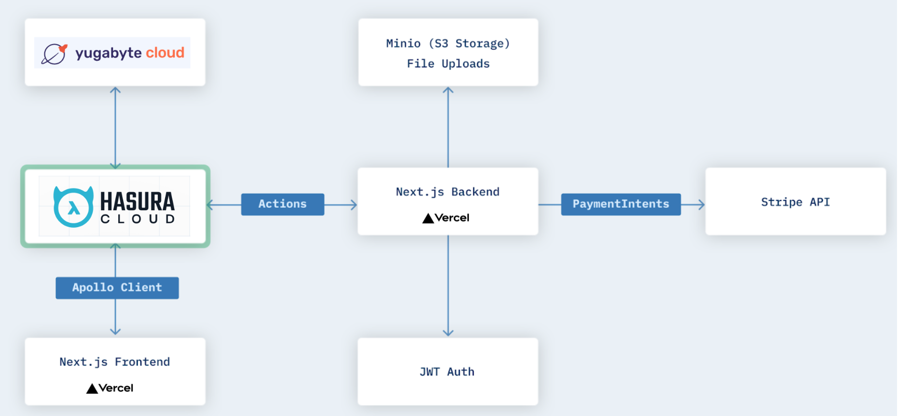

| Service             | Functionality                                                                |
| --------------------| ---------------------------------------------------------------------------- |
| Yugabyte Cloud      | PIM, Cart Management, User Management, User Authentication, Order Management |
| Hasura Cloud        | Business Logic Routing, Unified API, Access Control Management               |
| Vercel for NextJS   | Serverless business logic handlers, web application framework                |
| Stripe              | Payment handling                                                             |

## Cloud Deployment

Follow the steps below to run the apllication in the cloud using Hasura Cloud, Yugabyte Cloud and Vercel.

## Configure Hasura Cloud and Yugabyte Cloud

1. [Interconnect](https://docs.yugabyte.com/latest/yugabyte-cloud/cloud-examples/hasura-cloud/) your Hasura Cloud and Yugabyte Cloud instances.

2. Navigate to the `hasura` directory:
    ```bash
    cd hasura
    ```

3. Create the `config.yaml` file from the template for cloud deployments:
    ```bash
    cp cloud.config.yaml config.yaml
    ```

4. Open the `config.yaml` file and initialize two parameters: 
    * `endpoint` - use the value of the `GraphQL API` property of your Hasura Cloud project (without `/v1/graphql` in the end).
    * `handler_webhook_base_url` - same as above.
    * `admin_secret` - use the value of the `Admin Secret` property.

    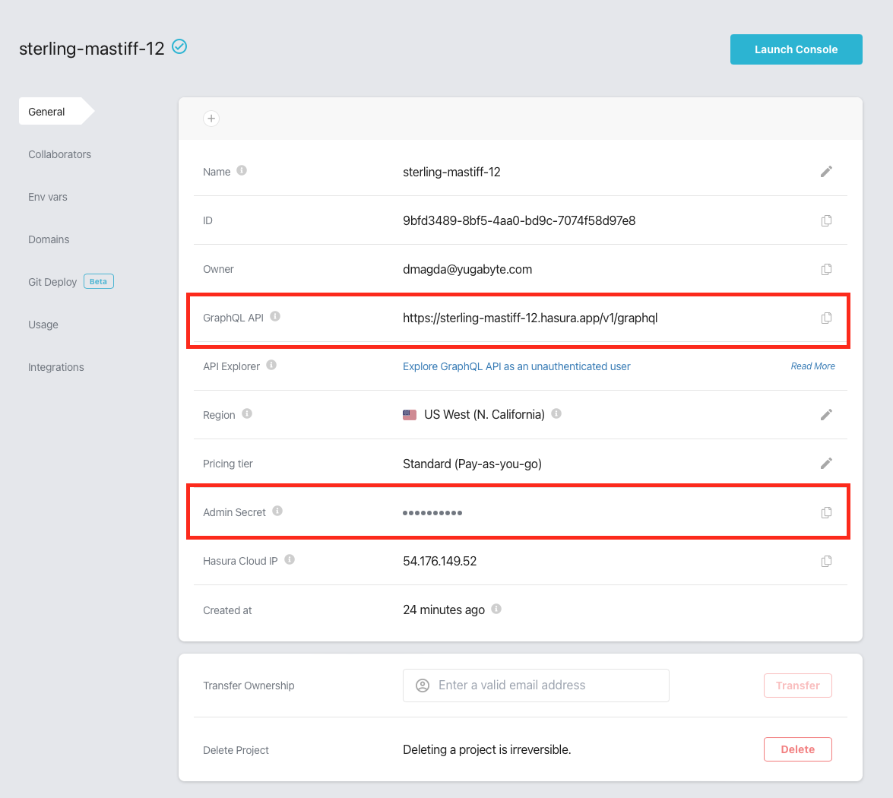

5. Create the `metadata/databases/databases.yaml` file from the template for cloud deployments:
    ```bash
    cp metadata/databases/cloud.databases.yaml metadata/databases/databases.yaml
    ```

6. Open the `metadata/databases/databases.yaml` file and update one parameter: 
    * `database_url` - use the value of the `Connection String` property. Put in quotes in the config file.

    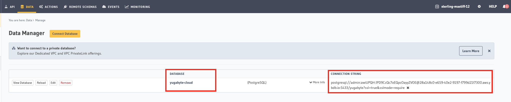

7. Apply metadata and load sample data:
    ```sh-session
    hasura metadata apply
    hasura migrate apply
    hasura metadata reload
    hasura seeds apply
    ```

## Deploy Next.js App in Cloud

Follow these steps to deploy the app to Vercel and connect it to the Hasura Cloud service and your Stripe account (if you need checkout to work).

### Deploy to Vercel

1. Log in to your [Vercel](https://vercel.com) account.

2. Create a new Vercel project by importing [the project's Git repository](https://github.com/dmagda/hasura-ecommerce)

    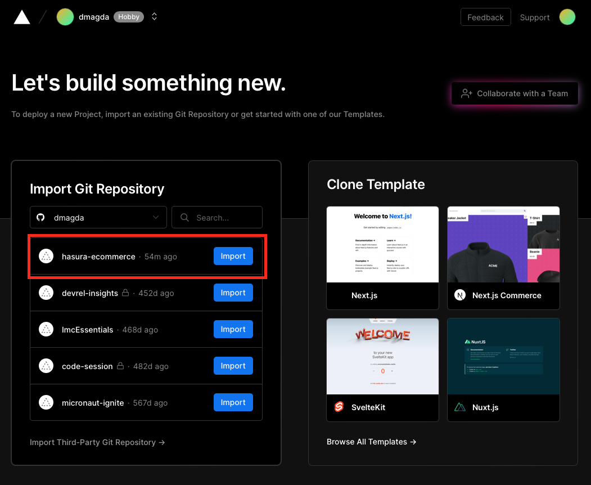

3. Configure the project:

    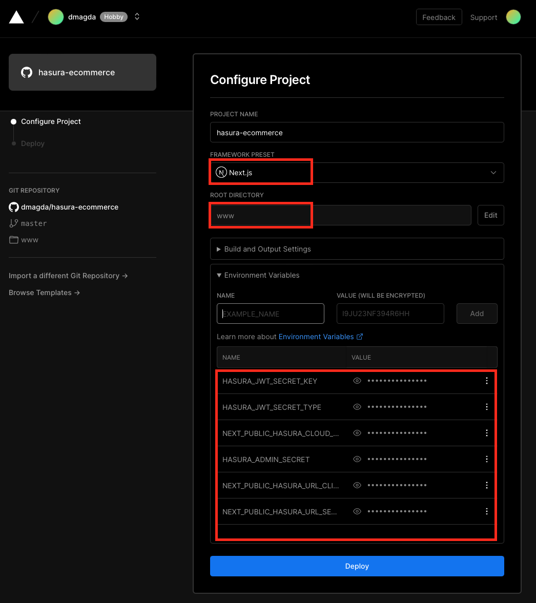
    
    * **Framework Preset** - select `Next.js`
    * **Root Directory** - set to `www`
    * **Environment Variables**:
        * `NEXT_PUBLIC_HASURA_URL_SERVERSIDE` - the value of the `GraphQL API` property of your Hasura Cloud project (without `/v1/graphql` in the end).
        * `NEXT_PUBLIC_HASURA_URL_CLIENTSIDE` - same as above.
        * `HASURA_ADMIN_SECRET` - the `Admin Secret` property from your Hasura Cloud project.
        * `NEXT_PUBLIC_HASURA_CLOUD_ADMIN_SECRET` - same as above.
        * `HASURA_JWT_SECRET_TYPE` - set to `HS256`.
        * `HASURA_JWT_SECRET_KEY` - set to `this-is-a-generic-HS256-secret-key-and-you-should-really-change-it` (or your custom key if you changed the default value).

4. Deploy the Project.

5. Open the app, once the project is deployed!

    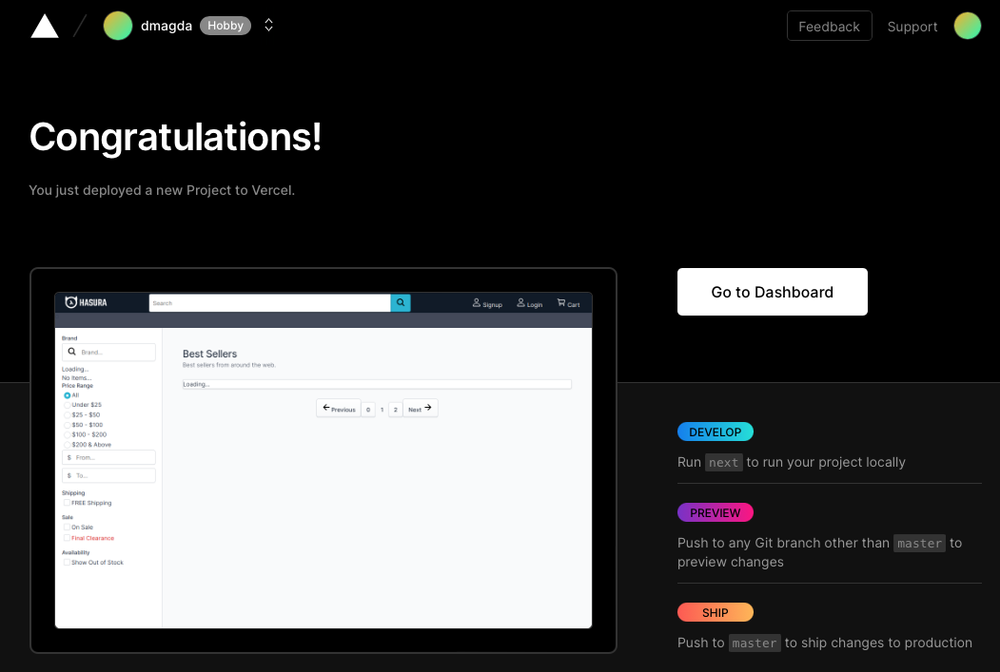


### Update Hasura Cloud Metadata

Your Hasura Cloud instance needs to know the address of the Vercel application to call several API endpoints. The APIs are implmented under the `www\pages\api` directory.

1. Open [Hasura Cloud](https://cloud.hasura.io) project's settings.

2. Add a new environment variable `NEXTJS_SERVER_URL` that refers to the address of your Vercel application instance (for instance, `https://hasura-ecommerce.vercel.app`)

    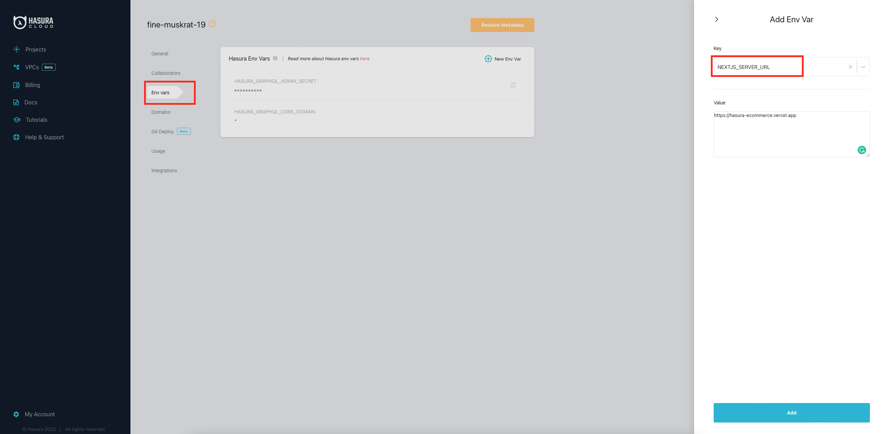

3. Wait while Hasura updates the metadata. You should NOT have any metadata conflicts after this step is over.

### Enable Checkout With Stripe

The application can use Stripe for the checkout feature. Follow these steps to connect Stripe to your app running in Vercel:

1. Create a Stripe account.

2. Navigate to the **Developers** dashboard.

    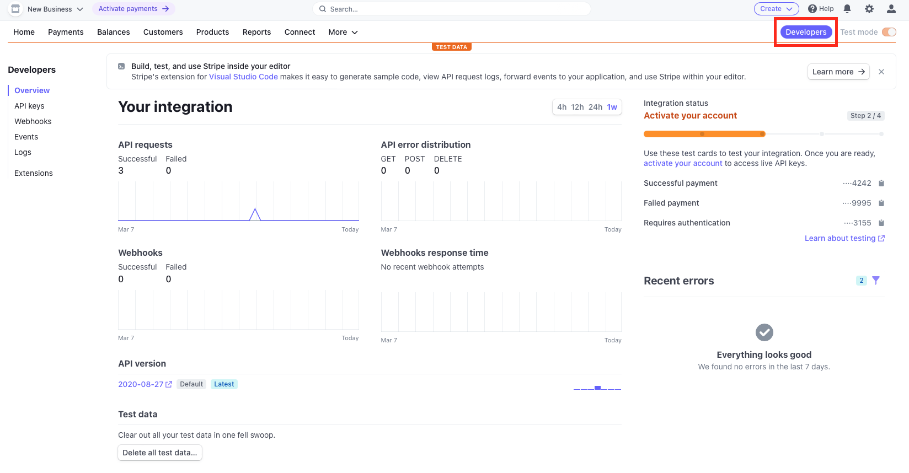

3. Configure a new **Webhook** asking Stripe to update the Vercel application on the payment status changes:

    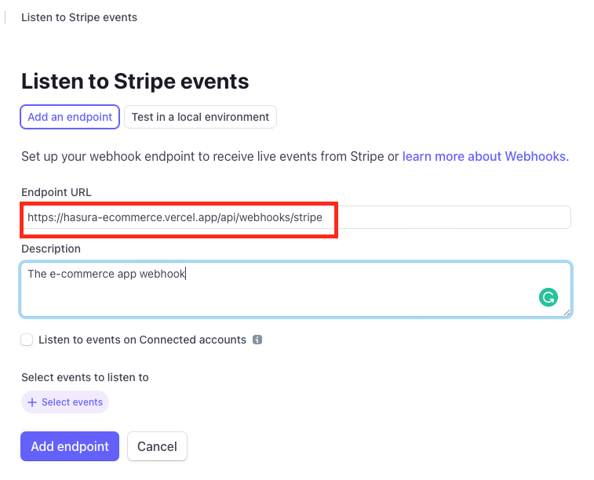

    * **Endpoint URL** - the format is `{your_vercel_app_URL}/api/webhooks/stripe` (for instance, `https://hasura-ecommerce.vercel.app/api/webhooks/stripe`)
    * **Events to Listen** - select to listen to all the events under the `payment_intent.*` category.


4. Go to the **Developers->API keys** screen and find the `Publishable key` and `Secret key` parameters.

    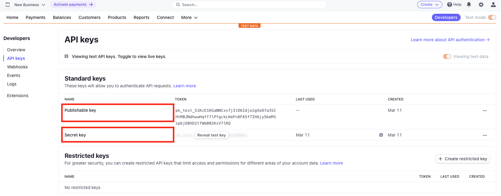

5. Open the **Settings->Environment Variable** dashboard of your Vercel application and add these parameters there:

    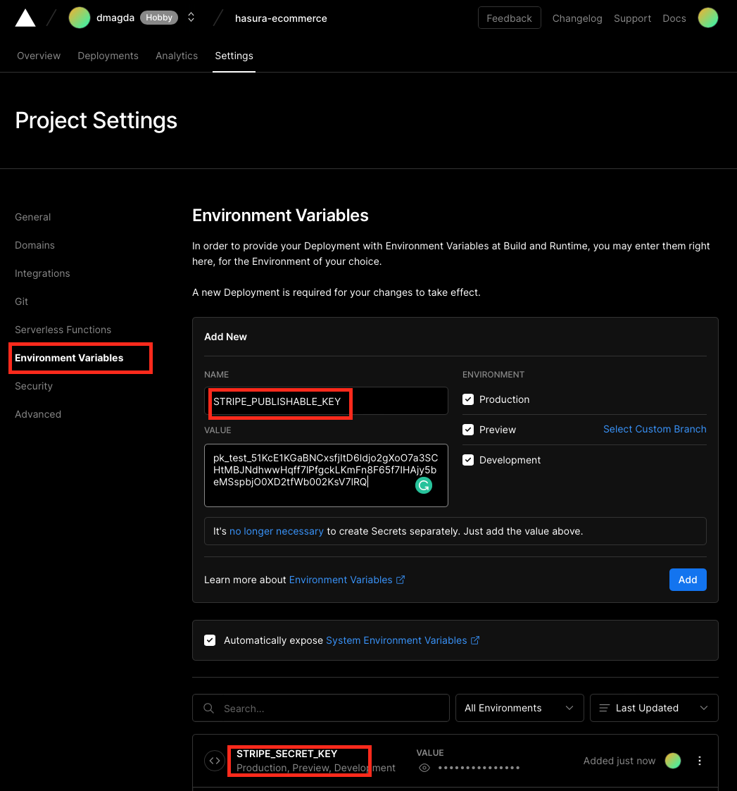

    * `STRIPE_SECRET_KEY` - your Stripe secret key.
    * `STRIPE_PUBLISHABLE_KEY` - your Stripe publishable key.

6. Redeploy the Vercel app to apply the changes.

## Deploy Next.js App Locally

Note, you don't need to follow the steps below if you deployed the app to Vercel. These instructions are for running the app locally.

1. Go to the root directory of the project.

2. Create the `.env` file:
    ```bash
    cp .env.cloud.example .env
    ```

3. Open the `.env` file and initialize parameters:
    * `HASURA_CLOUD_URL` - your Hasura Cloud GraphQL API URL (without `/v1/graphql` in the end)
    * `HASURA_CLOUD_ADMIN_SECRET` - your Hasura Cloud admin secret.
    * `STRIPE_*` - stripe related parameters if you want checkout to work.

4. Start the application locally with Docker:
    ```bash
    docker-compose -f docker-compose-cloud.yaml up
    ```

5. Visit the following endpoints:
    ```sh-session
    Visit http://localhost:3000 for Next.js frontend
    Login at /account/login has default credentials "user@site.com:password"
    Login at /admin/account/login has default credentials "admin@site.com:password"
    Visit http://localhost:8060 for Hasura console (admin secret = "my-secret")
    Visit http://localhost:9000 for Minio dashboard (login = "minio:minio123")
    Visit http://localhost:7001 for Yugabyte Master UI
    Visit http://localhost:9001 for Yugabyte TServer UI
    ```